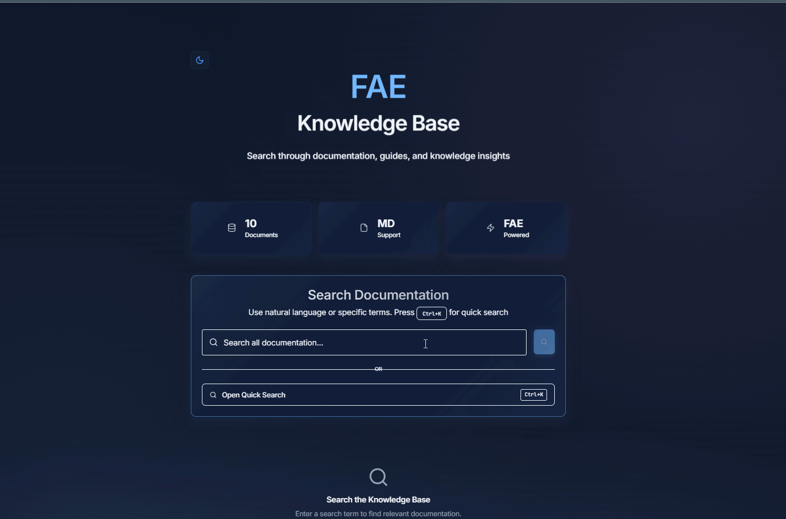
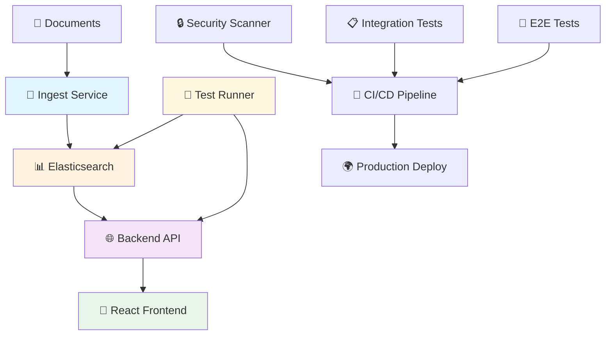

# 🚀 FAE Knowledge Base - Microservices Edition

[](https://python.org)
[](https://flask.palletsprojects.com)
[](https://reactjs.org)
[](https://docker.com)
[](https://elastic.co)
[](https://github.com/features/actions)

**Enterprise-ready microservices knowledge base** with independent document ingestion, comprehensive testing, and automated CI/CD deployment.



## 🎯 **What's New in Microservices Edition**

### ✅ **Independent Services**
- **🔄 Ingest Service** - Run document indexing whenever you want
- **🌐 Backend API** - Starts only after successful ingestion  
- **🧪 Test Runner** - Isolated testing environment
- **📊 Elasticsearch** - Dedicated search engine

### ✅ **Enterprise CI/CD**
- **🔒 Security Scanning** - Automated vulnerability detection
- **🧪 25+ Integration Tests** - Comprehensive test coverage
- **🚀 End-to-End Testing** - Full stack validation
- **📦 Automated Deployment** - Production-ready pipelines

### ✅ **Developer Experience**
- **⚡ Independent ingestion** - Update documents without downtime
- **🛡️ Reliable orchestration** - Backend waits for successful ingestion
- **🔧 Multiple environments** - Development, testing, production configs

---

## 🚀 **Quick Start**

### **Option 1: Production Setup (Recommended)**
```bash
# Clone and start everything
git clone https://github.com/Cwilliams333/FAE-Knowledge-Base.git
cd FAE-Knowledge-Base

# One command to rule them all
docker compose up --build
```

**✨ What happens:**
1. 📊 Elasticsearch starts and becomes healthy
2. 🔄 Ingest service indexes your documents and exits
3. 🌐 Backend API starts (only after successful ingestion)
4. 🎉 **Ready!** Visit http://localhost:5000

### **Option 2: Independent Document Updates**
```bash
# Add new documents anytime
cp your-new-docs/*.md documents/

# Run only ingestion (backend stays running!)
docker compose up ingest

# ✅ New documents are immediately searchable
```

### **Option 3: Development Mode**
```bash
# Start with development configuration
docker compose -f docker-compose.dev.yml up --build
```

---

## 🏗️ **Microservices Architecture**



### **🐳 Docker Images**
- **`fae-knowledge-base-ingest`** - Document indexing service
- **`fae-knowledge-base-backend`** - Flask API server  
- **`fae-knowledge-base-test-runner`** - Testing environment
- **`elasticsearch:9.0.0`** - Search engine

### **🔄 Service Dependencies**
- **Backend** waits for **ingest** to complete successfully
- **Test runner** waits for both **elasticsearch** and **backend**
- **Ingest** runs independently and exits when complete

---

## 📁 **Project Structure**

```
FAE-Knowledge-Base/
├── 🐳 Docker Configuration
│   ├── docker-compose.yml          # Production orchestration
│   ├── docker-compose.dev.yml      # Development setup  
│   ├── docker-compose.test.yml     # Testing environment
│   ├── Dockerfile.backend          # Backend API image
│   ├── Dockerfile.ingest           # Document indexing image
│   └── Dockerfile.test             # Testing environment image
│
├── 🔧 Application Code
│   ├── app.py                      # Flask backend API
│   ├── ingest.py                   # Document indexing logic
│   ├── ingest_wrapper.py           # Health monitoring wrapper
│   └── test_runner.py              # Test orchestration
│
├── 🧪 Testing Infrastructure  
│   ├── tests/                      # Test suites (25+ tests)
│   ├── test_documents/             # Sample test data
│   ├── pytest.ini                 # Test configuration
│   └── scripts/                    # Testing scripts
│
├── 🚀 CI/CD Pipeline
│   ├── .github/workflows/ci-cd.yml # Complete CI/CD automation
│   └── .github/workflows/         # Additional workflows
│
├── 📊 Frontend (React + TypeScript)
│   ├── frontend/src/               # React application  
│   ├── frontend/components/        # UI components
│   └── frontend/package.json       # Frontend dependencies
│
├── 📄 Documentation
│   ├── README.md                   # This file
│   ├── documents/                  # Your knowledge base content
│   └── test_documents/             # Example documents
│
└── ⚙️ Configuration
    ├── requirements.txt            # Python dependencies
    ├── requirements-dev.txt        # Development dependencies
    └── .env.example               # Environment template
```

---

## 🔄 **Document Management**

### **🚀 Independent Ingestion (Zero Downtime)**
```bash
# Add new documents to your knowledge base
cp new-documentation/*.md documents/

# Run ingestion independently (backend stays running!)
docker compose up ingest

# ✅ Documents are immediately searchable
# ✅ No service interruption
# ✅ Backend automatically detects new content
```

### **📊 Scheduled Updates**
```bash
# Create a simple update script
cat > update-docs.sh << 'EOF'
#!/bin/bash
echo "🔄 Updating knowledge base..."
docker compose up ingest
echo "✅ Update complete! Documents are now searchable."
EOF

chmod +x update-docs.sh

# Run anytime you want to update
./update-docs.sh
```

### **🔍 Verify Ingestion**
```bash
# Check document count
curl http://localhost:5000/stats

# Test search functionality  
curl -X POST http://localhost:5000/search \
  -H "Content-Type: application/json" \
  -d '{"query":"your search term"}'

# Check backend health
curl http://localhost:5000/health
```

---

## 🧪 **Testing Infrastructure**

### **🏃‍♂️ Run Tests**
```bash
# Full test suite (25+ tests)
scripts/test-new.sh

# Quick smoke tests
scripts/quick-test.sh

# Development testing
docker compose -f docker-compose.test.yml up --abort-on-container-exit test-runner
```

### **📋 Test Categories**
- **🔗 Health Endpoint Tests** - Service availability
- **📊 Stats Endpoint Tests** - Document counting  
- **🔍 Search Functionality** - Query processing
- **📄 Document Retrieval** - Content access
- **🛡️ Error Handling** - Edge case validation
- **🔄 API Integration** - End-to-end workflows

### **🎯 Test Results**
```
================================ test session starts ==============================
tests/test_api.py::TestHealthEndpoint::test_health_check PASSED          [  4%]
tests/test_api.py::TestStatsEndpoint::test_stats_endpoint PASSED         [ 12%] 
tests/test_api.py::TestSearchEndpoint::test_search_endpoint_success PASSED [ 20%]
tests/test_api.py::TestDocumentEndpoint::test_get_document_success PASSED [ 48%]
tests/test_api.py::TestAPIIntegration::test_full_search_workflow PASSED  [ 96%]
tests/test_api.py::TestAPIIntegration::test_api_consistency PASSED       [100%]
========================== 25 passed in 0.61s ===============================
```

---

## 🚀 **CI/CD Pipeline**

### **🔄 Automated Workflows**
```yaml
# Triggered on: push to main, pull requests
Code Quality → Unit Tests → Build Images → Integration Tests → Security Scan → E2E Tests → Deploy
```

### **🔒 Security & Quality**
- **🛡️ Trivy vulnerability scanning** - Container security
- **🧪 25+ automated tests** - Comprehensive coverage  
- **📊 Code coverage reporting** - Quality metrics
- **🔍 Dependency scanning** - Supply chain security

### **📊 Pipeline Status**
Each push triggers:
1. **✅ Code Quality Checks** (9s)
2. **✅ Unit Tests** (16s)  
3. **✅ Build Docker Images** (26s)
4. **✅ Integration Tests** (1m 21s)
5. **✅ Security Scanning** (0s - parallel)
6. **✅ End-to-End Tests** (0s - main branch only)
7. **🚀 Production Deployment** (main branch only)

---

## ⚙️ **Configuration**

### **🌍 Environment Variables**
```bash
# Core Configuration
ES_HOST=http://elasticsearch:9200           # Elasticsearch connection
INDEX_NAME=knowledge_base                   # Search index name  
DOCUMENTS_DIR=/app/documents               # Document directory
FLASK_ENV=production                       # Environment mode

# Service Configuration
API_BASE_URL=http://backend:5000          # Backend API endpoint
PORT=5000                                 # Backend server port

# Testing Configuration  
TEST_ENV=docker                           # Test environment
WITH_COVERAGE=true                        # Enable coverage reporting
```

### **🐳 Docker Compose Environments**

#### **Production (`docker-compose.yml`)**
```bash
docker compose up --build
# ✅ Optimized for production
# ✅ Automatic health checks
# ✅ Service dependencies
# ✅ Volume persistence
```

#### **Development (`docker-compose.dev.yml`)**
```bash
docker compose -f docker-compose.dev.yml up
# ✅ Development settings
# ✅ Hot reloading
# ✅ Debug logging
# ✅ Development ports
```

#### **Testing (`docker-compose.test.yml`)**
```bash
docker compose -f docker-compose.test.yml up test-runner
# ✅ Isolated test environment
# ✅ Test data seeding  
# ✅ Coverage reporting
# ✅ Artifact collection
```

---

## 🛠️ **Development**

### **🏃‍♂️ Local Development**
```bash
# Option 1: Full Docker development
docker compose -f docker-compose.dev.yml up --build

# Option 2: Hybrid development (Elasticsearch in Docker, app local)
docker run -d -p 9200:9200 \
  -e "discovery.type=single-node" \
  -e "xpack.security.enabled=false" \
  elasticsearch:9.0.0

pip install -r requirements-dev.txt
python ingest.py && python app.py
```

### **🔧 Development Workflow**
```bash
# 1. Add new documents
cp new-docs/*.md documents/

# 2. Test ingestion
docker compose up ingest

# 3. Run tests
scripts/quick-test.sh

# 4. Test full pipeline  
docker compose -f docker-compose.test.yml up test-runner

# 5. Commit and push (triggers full CI/CD)
git add . && git commit -m "Add new documentation"
git push origin feature/new-docs
```

### **🧪 Testing Your Changes**
```bash
# Quick validation
scripts/quick-test.sh

# Full test suite
scripts/test-new.sh  

# Test specific scenarios
docker compose -f docker-compose.test.yml up test-runner

# Check test coverage
docker compose -f docker-compose.test.yml up test-runner
# Look for coverage.xml in artifacts
```

---

## 🌐 **API Reference**

### **🔍 Search API**
```bash
POST /search
Content-Type: application/json
{
  "query": "microservices architecture",
  "size": 10,
  "from": 0
}

# Response
{
  "total": 5,
  "results": [
    {
      "filename": "architecture.md",
      "content": "...",
      "highlight": "highlighted <em>microservices</em> content...", 
      "score": 1.234,
      "metadata": {
        "last_modified": "2024-01-15T10:30:00Z",
        "size": 2048
      }
    }
  ]
}
```

### **📊 Health & Statistics**
```bash
# Health check (includes all services)
GET /health
{
  "status": "healthy",
  "services": {
    "elasticsearch": "connected",
    "backend": "running", 
    "ingest": "completed"
  },
  "timestamp": "2024-01-15T10:30:00Z"
}

# Document statistics
GET /stats  
{
  "count": 42,
  "index_name": "knowledge_base",
  "last_updated": "2024-01-15T09:15:00Z",
  "index_size": "1.2MB"
}

# Service information
GET /
{
  "service": "FAE Knowledge Base API",
  "version": "2.0.0",
  "architecture": "microservices",
  "endpoints": ["/search", "/health", "/stats", "/document/<filename>"]
}
```

### **📄 Document API**
```bash
# Get specific document
GET /document/architecture.md
{
  "filename": "architecture.md",
  "content": "# Microservices Architecture\n\n...",
  "metadata": {
    "size": 2048,
    "last_modified": "2024-01-15T10:30:00Z"
  }
}

# Document not found
GET /document/nonexistent.md
{
  "error": "Document not found"
}
```

---

## 🔧 **Operations & Monitoring**

### **📊 Health Monitoring**
```bash
# Check all services
docker compose ps

# Service-specific health
curl http://localhost:5000/health      # Backend health
curl http://localhost:9200            # Elasticsearch health  

# View logs
docker compose logs backend           # Backend logs
docker compose logs ingest            # Ingestion logs
```

### **🔄 Operational Commands**
```bash
# Production startup
docker compose up -d --build

# Update documents only
docker compose up ingest

# Restart backend only  
docker compose restart backend

# View real-time logs
docker compose logs -f backend

# Check service dependencies
docker compose config
```

### **📋 Troubleshooting**
```bash
# Clean restart (removes all data)
docker compose down -v && docker compose up --build

# Debug ingestion issues
docker compose up ingest
docker compose logs ingest

# Debug backend issues  
docker compose logs backend
curl http://localhost:5000/health

# Test service communication
docker compose exec backend curl http://elasticsearch:9200
docker compose exec backend python -c "import requests; print(requests.get('http://elasticsearch:9200').json())"
```

---

## 🚀 **Production Deployment**

### **🌍 Production Setup**
```bash
# 1. Clone repository
git clone https://github.com/Cwilliams333/FAE-Knowledge-Base.git
cd FAE-Knowledge-Base

# 2. Configure production environment
cp .env.example .env
# Edit .env with production settings

# 3. Deploy with production compose
FLASK_ENV=production docker compose up -d --build

# 4. Verify deployment
curl http://your-domain.com/health
```

### **🔒 Production Considerations**
- **🛡️ Security**: Use reverse proxy (nginx/Apache) for SSL termination
- **📊 Monitoring**: Set up log aggregation and metrics collection
- **💾 Backup**: Regular backups of Elasticsearch data volume
- **📈 Scaling**: Consider Elasticsearch cluster for high availability  
- **🔄 Updates**: Use blue-green deployment for zero-downtime updates

### **📦 Production Environment**
```yaml
# Production docker-compose.override.yml
version: '3.8'
services:
  elasticsearch:
    environment:
      - "ES_JAVA_OPTS=-Xms1g -Xmx1g"  # Production memory
    deploy:
      resources:
        limits:
          memory: 2g
          
  backend:
    environment:
      - FLASK_ENV=production
    deploy:
      replicas: 2  # Load balancing
      resources:
        limits:
          memory: 512m
```

---

## 🤝 **Contributing**

### **🚀 Getting Started**
```bash
# 1. Fork and clone
git clone https://github.com/yourusername/FAE-Knowledge-Base.git
cd FAE-Knowledge-Base

# 2. Create feature branch
git checkout -b feature/amazing-feature

# 3. Set up development environment
docker compose -f docker-compose.dev.yml up --build

# 4. Make your changes and test
scripts/test-new.sh

# 5. Submit pull request
git push origin feature/amazing-feature
```

### **🧪 Testing Requirements**
- ✅ All existing tests must pass
- ✅ New features must include tests
- ✅ Integration tests must pass
- ✅ Security scans must pass

### **📋 Development Standards**
- **🐍 Python**: Follow PEP 8 style guidelines
- **🐳 Docker**: Use multi-stage builds for optimization
- **🧪 Testing**: Minimum 80% test coverage for new code
- **📝 Documentation**: Update README for any new features

---

## 📄 **License**

This project is licensed under the MIT License - see the [LICENSE](LICENSE) file for details.

---

## 🎉 **What Makes This Special**

### **🔄 Independent Ingestion**
Unlike traditional monolithic setups, you can update your knowledge base **without any downtime**:
```bash
cp new-docs/*.md documents/
docker compose up ingest  # Backend stays running!
```

### **🛡️ Production-Ready**
Enterprise-grade features out of the box:
- **✅ 25+ automated tests** with full CI/CD
- **✅ Security vulnerability scanning**  
- **✅ Health monitoring and metrics**
- **✅ Zero-downtime document updates**

### **🧪 Developer-Friendly**
Built for teams who ship fast:
- **✅ One-command setup** for any environment
- **✅ Independent service testing**
- **✅ Hot reloading in development**
- **✅ Comprehensive error handling**

---

**🎯 Ready to revolutionize your team's knowledge sharing?**

```bash
git clone https://github.com/Cwilliams333/FAE-Knowledge-Base.git
cd FAE-Knowledge-Base
docker compose up --build
```

**Visit http://localhost:5000 and start searching!** 🚀